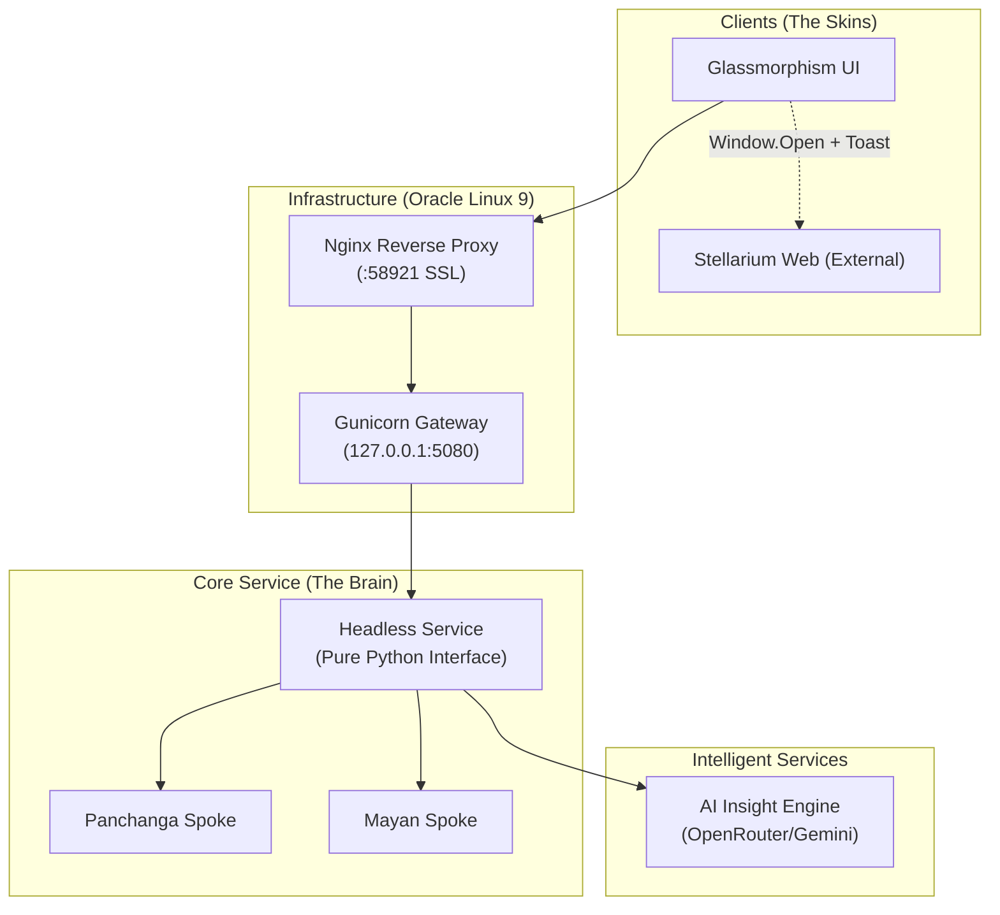

# Master Architecture Specification: Ancient Calendars v6.0.1
**The Framework-Agnostic, Headless Evolution**

## 1. Executive Summary
The Ancient Calendars project has evolved into a **Headless Digital Service** utilizing a "Split Architecture" for its frontend. This evolution ensures that the proven astronomical and calendar logic (The "Brain") is decoupled from the web framework and user interface (The "Skin"). This transition enables deployment on generic web servers/cloud instances (Oracle Linux 9) and supports diverse interactive modules like the Stellarium "Co-Pilot" integration.

---

## 2. Architectural Philosophy: Why Decouple?

### 2.1 The Case for Framework Independence
Traditionally, the application was a monolithic Flask app. We have transitioned to a decoupled state where:
-   **Frontend**: HTML5/JS templates (`templates/`) consume JSON APIs.
-   **Backend**: A pure Python library (`engines/`) exposed via a lightweight generic gateway.
-   **Scientific Isolation**: Astronomical calculations are treated as a verified library, shielded from UI changes.

### 2.2 The "Co-Pilot" Integration Pattern (Sky Map)
Instead of embedding heavy 3D libraries (like D3-Celestial) directly into the DOM, v6.0.1 adopts the **Co-Pilot Pattern**:
-   **External Context**: The Sky Map (Stellarium Web) launches in a dedicated parallel window/tab.
-   **Toast Guidance**: The main application provides "Toast Notifications" telling the user exactly what to search for in the external tool.
-   **Benefits**: Solves WASM memory constraints, allows dual-screen usage, and uses the best-in-class external visualizer without bloating the local app.

---

## 3. High-Level Architecture (The Hub & Spoke)

The system is now split into independent domains connected via a standardized JSON interface.



---

## 4. The Standardized JSON Interface
The Backend provides a **Stable Contract**. The UI cares only about the values.

### Sample Contract:
```json
{
  "metadata": {
    "civilization": "panchanga",
    "version": "2.0"
  },
  "results": {
    "primary": { "tithi": "...", "nakshatra": "..." },
    "astronomy": { "moon_long": 124.5, "sun_long": 34.2 }
  },
  "context": {
    "chat_role": "Astronomical Guide",
    "visual_targets": ["Moon", "Jyeshtha"]
  }
}
```

---

## 5. Implementation Roadmap: The 3-Phase Approach

### Phase 1: Headless UI & Logic Separation (Completed)
-   **Action**: Extracted UI logic. Created `insights_panchanga.html` as a standalone consumer.
-   **Status**: Done.

### Phase 2: Co-Pilot Integration (Completed v6.0)
-   **Action**: Replaced embedded sky maps with `window.open` flows.
-   **Action**: Implemented "Toast" guidance system.
-   **Status**: Done.

### Phase 3: Oracle Deployment Hardening (Current)
-   **Action**: SELinux whitelisting.
-   **Action**: Firewall port opening (58921).
-   **Status**: Validated on OCI.

---

## 7. Operational & Deployment Guide (Oracle Linux 9 / OCI)

Ancient Calendars v6.0.1 is optimized for **Oracle Linux 9**.

### 7.1 Automated Installation (`setup_fresh.sh`)
The orchestrator script handles the specific strictness of RHEL/Oracle Linux:

```bash
# 1. Deployment
export GOOGLE_API_KEY="your_key"
curl -L https://raw.githubusercontent.com/nanjunda/ancient_calendar_v2.1/main/setup_fresh.sh | bash
```

### 7.2 Critical System Constraints
1.  **SELinux**: The script explicitly sets `httpd_can_network_connect` and `httpd_unified` booleans to allow Nginx to talk to Gunicorn.
2.  **Firewall**: Port **58921** is opened via `firewall-cmd`.
3.  **Fapolicyd**: On some Oracle images, the File Access Policy Daemon (`fapolicyd`) blocks custom Python virtualenvs. The script detects and handles this.

### 7.3 Service Management
-   **Restart**: `sudo systemctl restart ancient_calendar_v2.1`
-   **Logs**: `sudo journalctl -u ancient_calendar_v2.1 -f`

---

## 8. AI Engine Configuration (The Double-Spoke)

### 8.1 Double-Spoke Prompt Architecture
1.  **Foundation**: "Astro-Tutor" persona (JSON strictness, Markdown formatting).
2.  **Context**: Specific civilization knowledge (Panchanga/Mayan).

### 8.2 Provider Selection
| Variable | Description |
| :--- | :--- |
| `AI_PROVIDER` | `gemini` (Standard), `openrouter` (Default) |
| `AI_MODEL_OVERRIDE` | e.g. `google/gemini-2.0-flash-exp:free` |

---

## 9. Verification & Stability
**"Zero Mutation" Principle**:
1.  **Mathematical Parity**: `verify_parity.py` ensures 100% match with v1.0 logic.
2.  **Stress Testing**: `stress_test_parity.py` checks edge cases.

---
**Last Updated**: February 5, 2026
